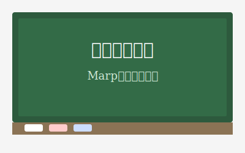

<!-- _paginate: skip -->

# Marpで始めるスライド作成

Markdownで作るシンプルなプレゼンテーション

- 2026-05-22
- ME高谷秀明

---

# 目次

1. Marpとは
2. PowerPointとの比較
3. 使いやすさと弱点
4. 標準テーマ
5. フォント設定 (PDF対策)
6. 授業で使える機能
7. 導入方法
8. VSCode Marpプラグインの使い方

---

# Marpとは

- **Markdown** でスライドを作成するツール
- `---` で区切るだけでスライドが増える
- 出力形式:HTML・PDF・PPTX
    - ただしPPTXはスライドを背景画像として埋め込むから編集不可
- 無料・オープンソース

> Markdownとは:見出しや箇条書きを記号で表すシンプルなテキスト記法

---

# PowerPointと比べた利点

| 項目             | PowerPoint              | Marp                       |
| ---              | ---                     | ---                        |
| ファイル形式     | バイナリ (差分不明)     | テキスト (差分が見える)    |
| バージョン管理   | 難しい                  | Gitで管理できる            |
| コードの貼り付け | 手間                    | シンタックスハイライト付き |
| 価格             | 有料 (または要サブスク) | 無料                       |
| OS依存           | あり                    | なし                       |

---

# 得意・不得意

**得意なこと**

- 箇条書き・表・コード・数式は簡単に書ける
- テキストエディタだけで完結する
    - **生成AI** と相性がとても良い (このスライドはほぼAI製)

**苦手なこと**

- 細かいレイアウト
    - 2段組・文字の上揃え等はHTML, CSSの知識が必要
- 図形・矢印の描画は不向き
    - pptxにして後から書き足す、画像に埋め込む必要がある

---

# 標準テーマ

Marpには3つのテーマが標準で付属しています。

| テーマ名  | 特徴                                   |
| ---       | ---                                    |
| `default` | 白背景・黒文字。シンプルで印刷しやすい |
| `gaia`    | 紺背景・白文字。プロジェクター向き     |
| `uncover` | 白背景・オレンジ下線アクセント         |

フロントマターの1行を変えるだけで切り替えられます:`theme: gaia`

このスライドは `default` を使っています。

---

# フォント設定 (PDF対策)

設定なしでPDFを生成すると **中国語フォント** が混入することがある。

**原因**: ChromiumがCJK文字 (日本語・中国語・韓国語) を同じUnicode範囲とみなし、環境によって中国語フォントを優先するため。

**対策**: フロントマターの `style` でフォントを明示する。

```yaml
style: |
  @import url('https://fonts.googleapis.com/css2?family=Noto+Sans+JP:wght@400;700&display=swap');
  section {
    font-family: 'Noto Sans JP', sans-serif;
  }
```

このスライドでも上記の設定を適用済み。

---

# 授業で使える機能

- **見出し** (章タイトル・節タイトル)
- **箇条書き** (番号なし・番号あり)
- **画像** (写真・図)
- **表** (比較表・データ)
- **数式** (理数系科目で活躍)

---

# 見出し

`#` 記号の数で見出しのレベルが変わります。

```markdown
# 大見出し (スライドタイトル)
## 中見出し
### 小見出し
```

(`####` 以降もあるがあまり使わない)

---

# 大見出しの例

## 中見出しの例

### 小見出しの例

本文テキストはこのように表示されます。

---

# 箇条書き

**番号なし**

```markdown
- りんご
- みかん
  - 温州みかん  ← インデントで階層化
```

**番号あり**

```markdown
1. 準備する
2. 考える
3. 実行する
```

---

# 箇条書きの例

**番号なし**

- 国語
- 数学
  - 代数
  - 幾何

**番号あり**

1. 問題を読む
2. 方針を立てる
3. 計算する

---

# 画像の挿入

```markdown

```

- `説明文` は画像が表示できないときに代わりに現れるテキスト
- 幅・高さを指定する場合:

```markdown
   ← 幅を300pxに
   ← 高さを200pxに
  ← 右半分を背景画像に
```

- その他オプション: https://marpit.marp.app/image-syntax

---

# 画像の例



このように画像を挿入できます。

---

# 表 (テーブル)

`|` と `-` で表を書きます。

```markdown
| Column 1 | Column 2 | Column 3 |
| -----    | -----    | -----    |
| A        | B        | C        |
| D        | E        | F        |
```

2行目の `---` は必須 (列の区切りを示す)
- 見出しがない表は標準では書けない

---

# 表の例

| 曜日   | 1限   | 2限   | 3限   |
| ------ | ----- | ----- | ----- |
| 月     | 国語  | 数学  | 体育  |
| 火     | 理科  | 英語  | 音楽  |
| 水     | 数学  | 国語  | 図工  |

---

# 数式

Marpは数式表示に対応しています。
- 描画エンジンとしてMathJax/KaTeXが使われる (デフォルトはMathJax)

インライン数式 (文中に埋め込む):

```markdown
質量エネルギー等価式は $E = mc^2$ です。
```

ブロック数式 (独立して表示):

```markdown
$$
x = \frac{-b \pm \sqrt{b^2 - 4ac}}{2a}
$$
```

---

# 数式の例

インライン: $E = mc^2$、$a^2 + b^2 = c^2$

二次方程式の解の公式:

$$
x = \frac{-b \pm \sqrt{b^2 - 4ac}}{2a}
$$

---

# 導入 (1/2): Visual Studio Code のインストール

1. ブラウザで `https://code.visualstudio.com/` を開く
2. 「Download for Windows」 ボタンをクリック
3. ダウンロードした `.exe` ファイルを実行
4. 「次へ」を押すだけでインストール完了

macOS / Linux は各OS向けのインストーラを選択してください。

---

# 導入 (2/2): Marp for VS Code プラグイン

1. VS Code を起動する
2. 左サイドバーの 拡張機能アイコン (田の字) をクリック
3. 検索欄に `Marp` と入力する
4. 「Marp for VS Code」 (作者: marp-team) を選んで「インストール」をクリック

拡張機能は無料で使えます。

---

# VSCode Marpプラグインの使い方

**プレビューを見る**

1. 拡張子 `.md` のファイルを作成・開く
2. ファイル冒頭に `marp: true` を記述する
3. 右上のプレビューボタンをクリック → スライドがリアルタイム表示

**HTML / PDF / PowerPoint に書き出す**

1. コマンドパレット (`Ctrl+Shift+P`) を開く
2. `Marp: Export Slide Deck...` を選択
3. 出力形式を選んで保存

---

<!-- _paginate: false -->

# まとめ

- Marpはテキストファイルでスライドを作れるツール
    - テキストなので**生成AI**と相性バツグン
- VSCode + Marpプラグイン で手軽に始められる
- 授業で使える機能は一通り揃っている
- 段組など苦手な部分は割り切って使う

このスライドを生成したコード: https://github.com/takatani-h/marp-intro
